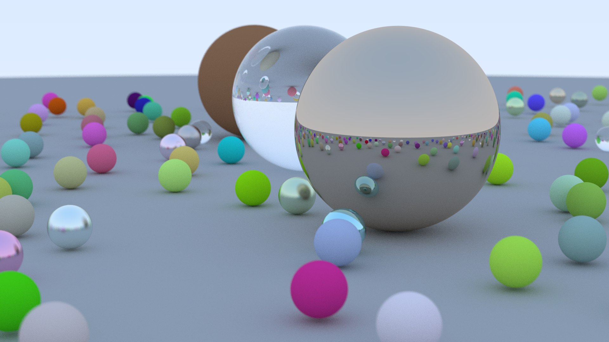

# RayTracingWeekend
This is me following Peter Shirley's [Ray Tracing in One Weekend](https://www.realtimerendering.com/raytracing/Ray%20Tracing%20in%20a%20Weekend.pdf).
I've followed the main outline of Peter's guide, but after diverging enough that the suggested refraction functions didn't work I instead dug into writing the dielectric material from scratch. I can highly recommend doing that yourself, since that was what really made me learn the mechanisms behind the equations. While doing this [Reflection & Refraction](https://graphics.stanford.edu/courses/cs148-10-summer/docs/2006--degreve--reflection_refraction.pdf), by Bram de Greve, proved to be a terrific resource.

De Greve also pointed out an interesting fact about Schlick's approximation in that it breaks down if used unmodified when the ray is transmitted from a higher to a lower refractive index medium. E.g. from glass to air. Modifying it according to the article had a very small, but noticable, impact on the end result.

# Final Render

